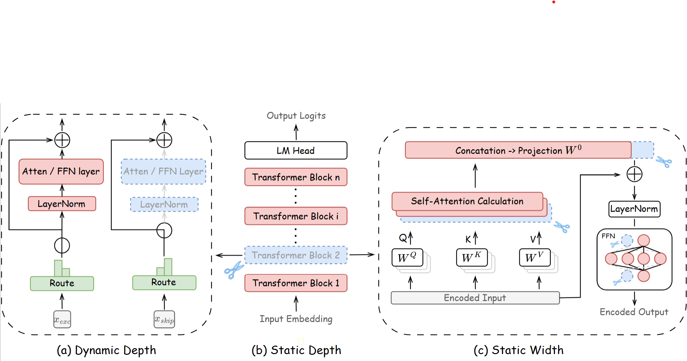

# From LLMs to LRMs: Rethinking Pruning for Reasoning-Centric Models

[](https://arxiv.org/abs/2601.18091)
[](https://arxiv.org/abs/2601.18091)
[](https://github.com/EIT-NLP/LRM-Pruning)

A unified evaluation framework for **structure-pruned LLMs** across **classification, generation, and reasoning**.


## Why this repo

Most pruning work targets **instruction-following LLMs (LLM-instruct)**, but it is unclear whether these pruning recipes transfer to **reasoning-augmented models (LLM-think)** that explicitly generate long intermediate reasoning traces.

This repo provides a **controlled and unified** evaluation pipeline:
- Aligns **pruning calibration** and **post-pruning recovery** data with each model’s original training distribution to obtain more stable pruning behavior. 
- Evaluates **static depth**, **static width**, and **dynamic depth** pruning across **17 tasks** spanning classification, generation, and reasoning. 

---

## Main findings (paper highlights)

Empirical takeaways you can expect to reproduce here:
- **Depth vs. width is task-dependent**: depth pruning tends to be better on **classification**, while width pruning is often more robust on **generation & reasoning**. :contentReference[oaicite:6]{index=6}
- **Static vs. dynamic is paradigm-dependent**: dynamic pruning is strong on LLM-instruct classification/generation, but can be fragile for **long-chain reasoning** in LLM-think; static pruning often preserves reasoning better. :contentReference[oaicite:7]{index=7}

---

## Supported pruning methods

We group structured pruning into three categories (matching the paper’s taxonomy): :contentReference[oaicite:8]{index=8}

### Static Depth (remove layers)
- **SLEB** — Paper: https://arxiv.org/abs/2402.09025 | Code: https://github.com/jiwonsong-dev/SLEB  
- **ShortGPT** — Paper: https://arxiv.org/abs/2403.03853 | Code: https://github.com/sramshetty/ShortGPT/tree/hf-models (unofficial HF impl)
- **Shortened-PPL / Shortened-Taylor** — Paper: https://arxiv.org/abs/2402.02834 | Code: https://github.com/Nota-NetsPresso/shortened-llm

### Static Width (shrink hidden dims / neurons / heads)
- **LLM-Pruner** — Paper: https://arxiv.org/abs/2305.11627 | Code: https://github.com/horseee/LLM-Pruner
- **SliceGPT** — Paper: https://arxiv.org/abs/2401.15024 | Code: https://github.com/microsoft/TransformerCompression

### Dynamic Depth (input-dependent skipping)
- **MOD** — Paper: https://arxiv.org/abs/2404.02258
- **DLLM** — Paper: https://papers.nips.cc/paper_files/paper/2024/hash/03469b1a66e351b18272be23baf3b809-Abstract-Conference.html
- **SkipGPT** — Paper: https://arxiv.org/abs/2506.04179 | Code: TODO (add link if available)

We are continuously integrating more structured pruning methods to expand coverage.

---

## Benchmarks

We evaluate pruned models on **instruction following** and **reasoning**.

### Instruction-following (LLM-instruct)

Classification:
- BoolQ, PIQA, HellaSwag, WinoGrande, ARC-E/ARC-C, OpenBookQA

Generation:
- IFEval, TruthfulQA, PopQA, HumanEval, HumanEval+

### Reasoning (LLM-think)
- AIME 2024, MATH-500, LiveCodeBench, GPQA-Diamond, JEEBench

> Note: the paper evaluates 17 tasks in total across these categories. 
---

## Quickstart

### Installation
```bash
git clone https://github.com/EIT-NLP/LRM-Pruning.git
cd LRM-Pruning

# TODO: recommend a pinned environment
conda create -n lrm-pruning python=3.10 -y
conda activate lrm-pruning

pip install -r requirements.txt
```

